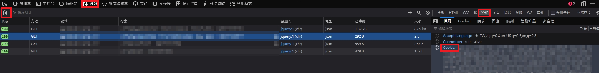
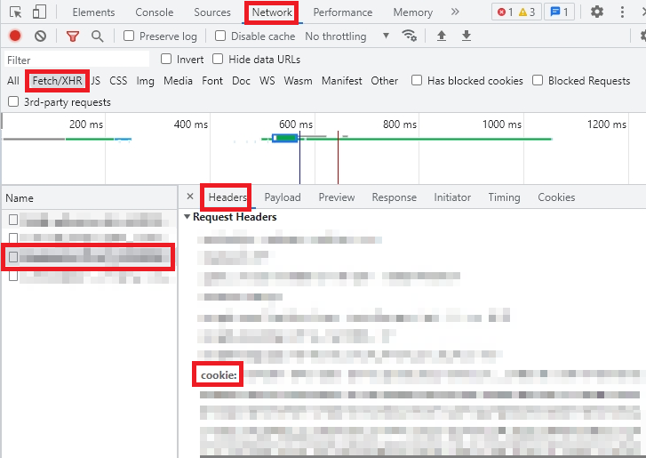
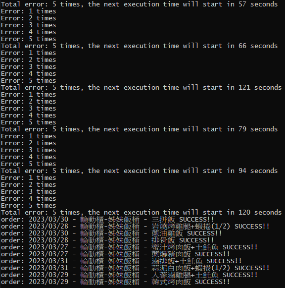

# crabeats
Automation of Realtek's internal crabeats ordering system

This program can automatically order meals from Realtek 2nd factory, \
making you are one of the proud members with "Golden 100". :fire: :grin::grin:

## Parameter Descriptions
- STARTDATE: Starting date for ordering meals.
- TOTALDAYS: Total number of days for ordering.
- RANDSECMIN: Minimum random time (in seconds).
- RANDSECMAX: Maximum random time (in seconds).
- SHOOTVENDOR: Name of the vendor for ordering meals.
- COOKIE: You must use your browser to find the ordering cookie.

## How to fetch your own COOKIE
### Firefox
- Login crabeats website
- type F12
- Goto Network page and XHR -> Header page
- Delete all data (click Trash Can icon)
- Refresh page (F5)
- Find your COOKIE data and copy it

### Chrome
- Login crabeats website
- type F12
- Goto Network page and Fetch/XHR page
- Refresh page (F5)
- Find your COOKIE data and copy it

## Environment setup
- Install the latest version of node.js https://nodejs.org/en
- Install node module - `request`

## Reminder
It is recommended to start running the program on Friday at 17:00. :clock5:

## Demo
Here are the execution results:

